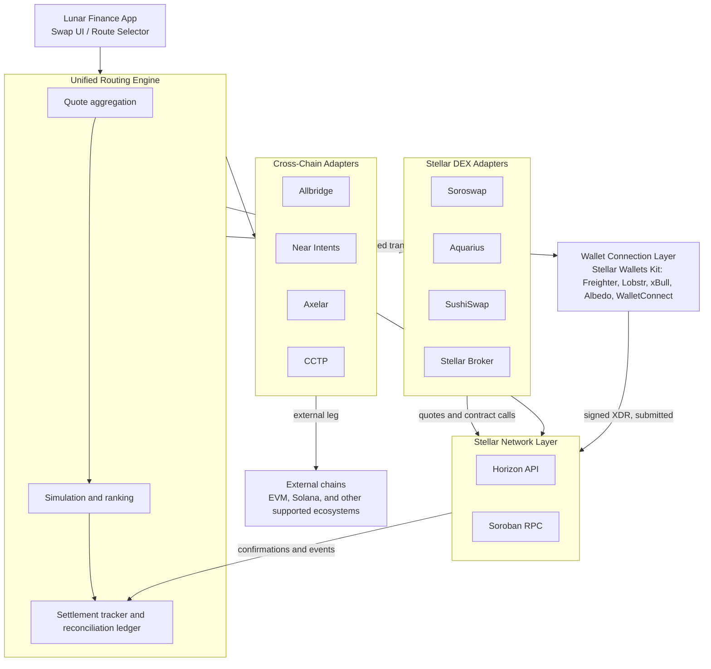
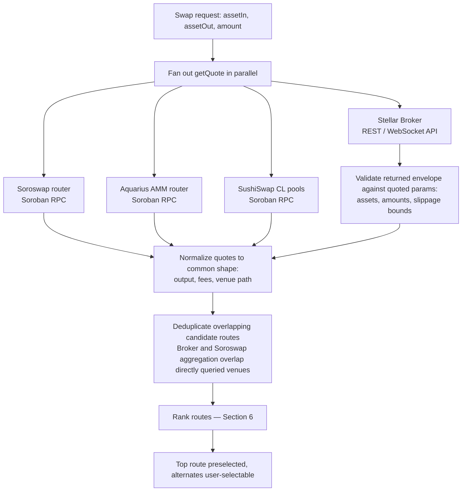
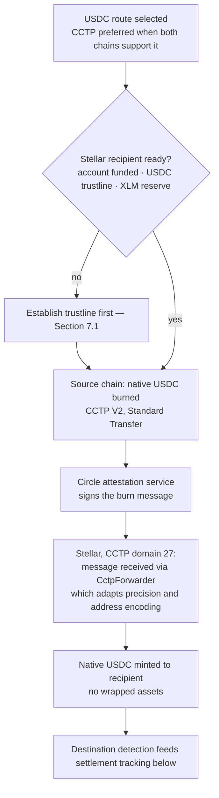
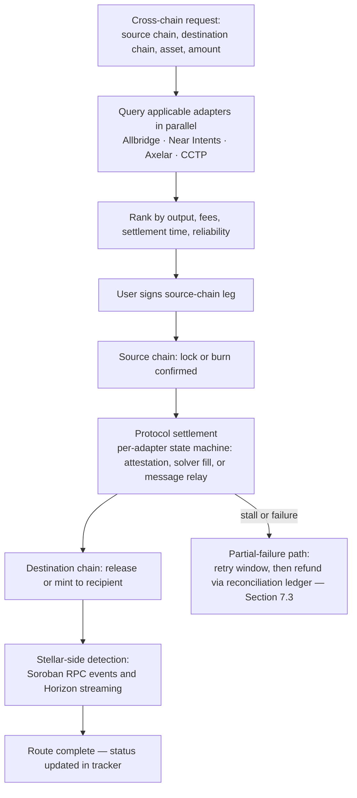
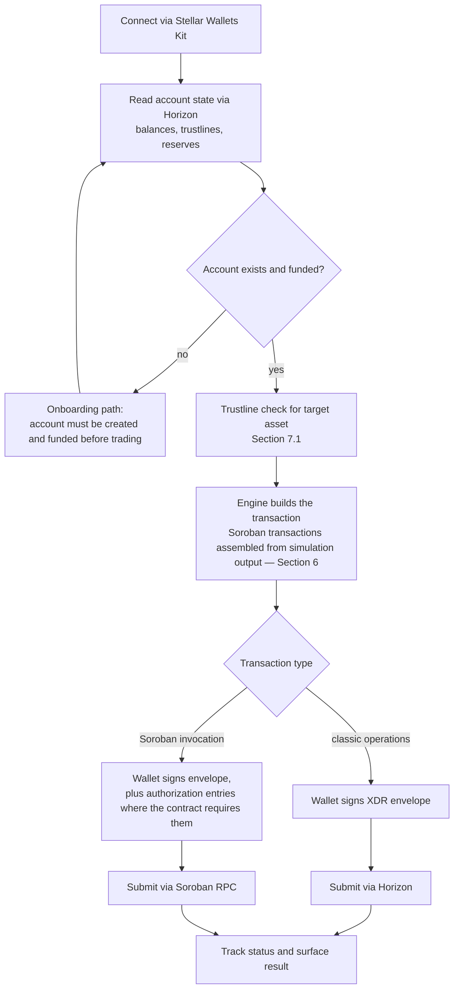
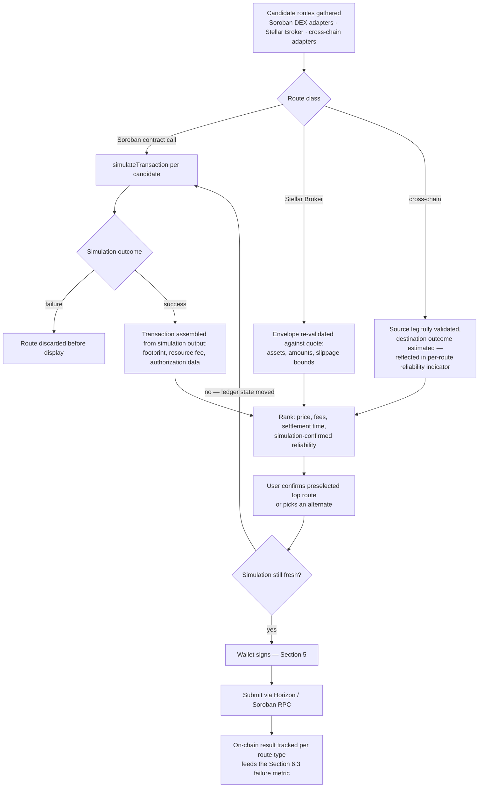
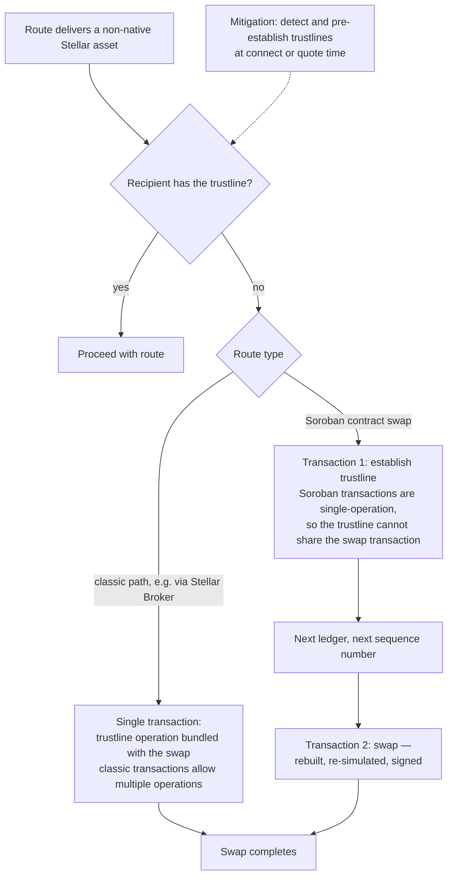
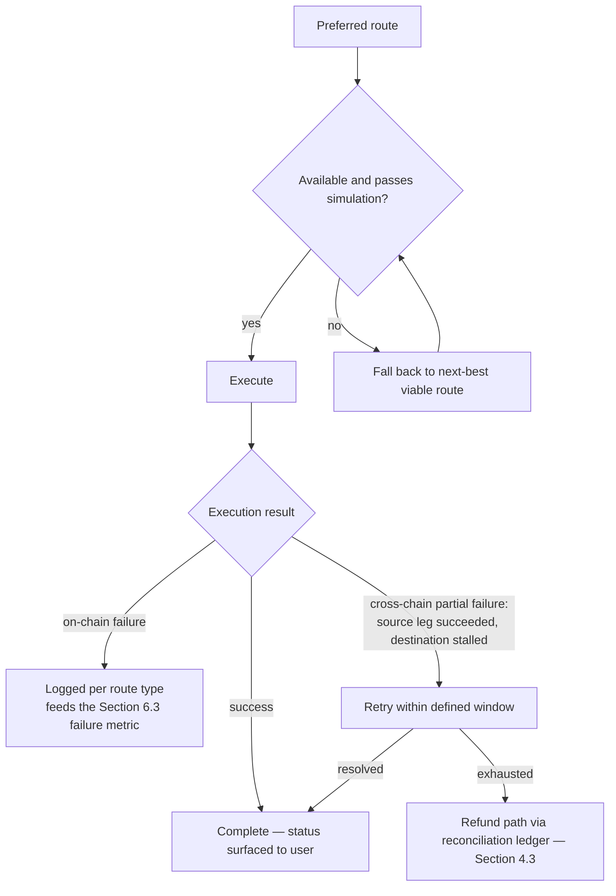

# Lunar Finance × Stellar Integration — Technical Implementation Plan

---

## 1. Overview

This document sets out the technical implementation plan for bringing Stellar into Lunar Finance's unified routing system. The integration delivers four capabilities:

1. **Stellar DEX aggregation** — unified routing across Stellar-native liquidity venues
2. **Cross-chain meta-aggregation** — routing between Stellar and external chains via bridge and intent-based protocols
3. **Stellar wallet support** — native wallet integration for signing and account management
4. **Routing engine with transaction simulation** — pre-execution simulation across all route types to reduce failure rates

Lunar Finance operates aggregation infrastructure spanning 40+ DeFi protocol integrations across multiple ecosystems. Stellar is added as a new set of adapters inside that existing system — not a parallel, Stellar-specific stack.

The plan is deliberately phased: a small set of high-liquidity sources is integrated and proven on testnet first, expanded on mainnet only after the core path works end to end (venue order in Section 3.2, protocol waves in Section 4.2). External protocol support cited in this document has been verified against live deployments as of August 2026.

---

## 2. System Architecture (High Level)

**Design principle:** each liquidity source or bridge is wrapped in a standardized adapter interface, so the routing engine can query, compare, and execute across sources without source-specific logic leaking into core routing code. This is the same adapter-framework pattern Lunar Finance already runs across its other chain integrations.

---

## 3. Component 1: Stellar DEX Aggregation

### 3.1 Objective

Aggregate liquidity from multiple Stellar venues into a single routing layer, so users get the best available price from one interface in the Lunar Finance app.

### 3.2 Liquidity sources

| Source | Type | Integration method |
|---|---|---|
| Soroswap | Soroban-native DEX/aggregator | Router contract via Soroban RPC, as a liquidity source in our aggregation layer |
| Aquarius (AQUA) | Soroban AMM — the deepest AMM/DEX liquidity on Stellar (~$45M TVL, DefiLlama, Aug 2026) | AMM router contract via Soroban RPC |
| SushiSwap | Soroban DEX with v3-style concentrated liquidity, live on Stellar since Feb 2026 | Router contract via Soroban RPC — a new Soroban implementation behind the same adapter interface as the SushiSwap integrations Lunar runs on EVM chains |
| Stellar Broker | Hosted multi-source swap router (Stellar Expert team) spanning SDEX, classic AMMs, Soroswap, and Aquarius | Its REST/WebSocket router API via the official client library, wrapped in our standard adapter interface |

Stellar Broker is integrated first: a single hosted API spanning SDEX, classic AMMs, Soroswap, and Aquarius, it delivers broad aggregation coverage early and remains a shippable path while direct adapter work matures (Section 8). Direct Soroban adapters follow in depth order — Soroswap and Aquarius, the deepest Soroban-native venues, then SushiSwap. Stellar's native order book (SDEX) is not a direct integration target at this stage; its liquidity remains reachable through Stellar Broker's routing across SDEX and classic AMMs. Because Stellar Broker and Soroswap's aggregator overlap with venues we also query directly, duplicate candidate routes are deduplicated at the ranking layer on venue-path identity, parsed from returned envelopes and route metadata, so the same pool reached twice is scored once (Section 6).

Initial mainnet pairs anchor on XLM–USDC (USDC on Stellar is natively issued by Circle), with further assets — e.g., EURC, AQUA — enabled as pair-level depth clears a minimum-liquidity threshold verified at integration time; aggregate venue TVL is not treated as a proxy for executable depth on any specific pair.

### 3.3 Technical approach

- **Soroban-based venues (Aquarius, Soroswap, SushiSwap)** are called via Soroban RPC. Router contract IDs are treated as versioned configuration, verified against official documentation at integration time and monitored for changes (e.g., after protocol upgrades or network resets) — never hardcoded permanently.
- **Stellar Broker** is queried through its hosted REST/WebSocket router API. Returned transaction envelopes are treated as untrusted input in full — source account, sequence, network, fees, time bounds, and every operation and sub-invocation are validated against the quoted parameters (assets, amounts, slippage bounds), not just the headline amounts; when Broker prepares a multi-transaction route, every envelope in the set is validated before any is passed to the wallet for signing.
- **Adapter interface**: every DEX source implements a common `getQuote(assetIn, assetOut, amount)` and `buildTransaction(route)` interface, so the routing engine treats Aquarius, Soroswap, SushiSwap, and Stellar Broker interchangeably. Assets are identified by their full Stellar identity — classic `code:issuer` pair or Soroban contract address, with SAC-wrapped classic assets carrying both — so routing never conflates same-code assets from different issuers.

**Quote flow:**

### 3.4 Key dependencies

- `@stellar/stellar-sdk` (official JavaScript SDK, v16+) for transaction building and Soroban contract interaction
- Horizon API access for account state, transaction submission, and streaming
- Soroban RPC access for AMM contract calls and simulation
- Stellar Broker router API access (REST/WebSocket) via its client library
- Trustline handling — Stellar requires an account trustline for any non-native asset; the swap flow detects missing trustlines and handles creation transparently (Section 7.1)

---

## 4. Component 2: Cross-Chain Meta-Aggregation

### 4.1 Objective

Enable routing of assets into and out of Stellar from external chains, making Stellar both a source and destination of liquidity within Lunar's multichain routing system.

### 4.2 Bridge and intent protocols

All four protocols below have **live Stellar support**, verified against their deployments in August 2026. Integration is still sequenced — a first wave of two protocols (one bridge-based, one intent-based), then the remainder — so each adapter ships with full settlement tracking and failure-path coverage rather than all landing at once.

| Protocol | Model | Role in routing | Status |
|---|---|---|---|
| Allbridge | Bridge (liquidity-pool) | Direct bridge route for supported pairs; Lunar already integrates Allbridge on other chains | First wave (Stellar support live since 2024) |
| Near Intents | Intent-based | Solver network fulfills cross-chain intents where a direct bridge route is unavailable or inefficient | First wave (Stellar live since Aug 2025) |
| Axelar | Bridge / general message passing | Broader chain coverage for less common destinations | Second wave (ITS live on Stellar) |
| CCTP (Circle) | Native USDC burn-and-mint | Preferred route for USDC — burn-and-mint of native USDC avoids wrapped-asset risk | Second wave (live on Stellar since May 2026) |

**A note on USDC:** USDC on Stellar is natively issued by Circle, and Circle's CCTP is live on Stellar as of May 2026 — native USDC moves between Stellar and other CCTP chains by burn-and-mint, with no wrapped assets. Stellar support is CCTP V2 (domain 27) with Standard Transfer semantics only — no Fast Transfer — and inbound transfers route through Circle's `CctpForwarder`, which adapts USDC precision and address encoding to Stellar; settlement-time estimates shown to users reflect Standard Transfer finality. Given USDC's centrality to Lunar's other product features (fiat ramp, Lunar Spend), the engine defaults to CCTP whenever both source and destination chains support it; first-wave protocols cover USDC routes until the CCTP adapter ships.

**USDC into Stellar via CCTP:**

### 4.3 Technical approach

- **Adapter pattern, consistent with Section 3**: each protocol is wrapped in an adapter exposing `getCrossChainQuote(sourceChain, destChain, asset, amount)`, returning estimated output, fees, and estimated settlement time.
- **Routing decision logic**: for a given cross-chain request, the engine queries all applicable adapters in parallel and ranks routes by a weighted score of price, fee, and speed/reliability (Section 6).
- **Settlement tracking**: each protocol settles through its own sequence of states — source lock/burn, then attestation, solver fill, or message relay, then destination release/mint — so each adapter implements an idempotent per-protocol settlement state machine rather than a generic two-confirmation model. Stellar-side completion is detected primarily via Soroban RPC's `getEvents` (contract-emitted transfer events — the right shape for watching one asset across many recipients), with Horizon streaming (Server-Sent Events, cursor-resumable) as a secondary listener on classic payment paths.
- **Memo hygiene**: Soroban transactions cannot carry a memo (`MEMO_NONE` is required), and memo-tagged deposits to custodial addresses are a classic Stellar footgun. Destination addresses are screened against known custodial/exchange patterns, and a route that would silently drop a required memo is blocked rather than executed.
- **Partial-failure handling**: defined retry/refund logic for the state where the source leg succeeds and the destination leg fails, reusing the reconciliation approach from Lunar's existing bridge infrastructure (Section 7.3).

**Cross-chain route lifecycle:**

### 4.4 Key dependencies

- Protocol SDKs or REST APIs for each integrated bridge/intent protocol
- Horizon streaming for real-time Stellar-side confirmation
- Lunar's existing cross-chain status/reconciliation ledger, reused rather than rebuilt

---

## 5. Component 3: Stellar Wallet Support

### 5.1 Objective

Integrate Stellar-native wallets for transaction signing and account management, with the same "connect wallet" experience users get on Lunar's other supported chains.

### 5.2 Approach

Rather than building one-off connectors per wallet, the connection layer is built on the **Stellar Wallets Kit**, the community-standard wallet abstraction for Stellar dApps. This provides Freighter, Lobstr (via its signer extension), xBull, Albedo, WalletConnect-connected mobile wallets, and others through a single interface — more wallets at launch, less bespoke connection code to maintain.

- **Launch targets**: Freighter (the reference extension wallet) and Lobstr (mobile-first, aligned with Lunar's mobile-first product) are the first-class, fully tested paths. Other kit-supported wallets are enabled on a best-effort basis.
- **Signing flow**: transactions are constructed with the Stellar SDK and passed to the connected wallet through the kit's SEP-43 interface — XDR envelope signing (`signTransaction`), plus authorization-entry signing (`signAuthEntry`) where a Soroban invocation requires it — then submitted through Horizon (or Soroban RPC for contract transactions).
- **Contract accounts**: smart wallets (passkey signers) authorize via Soroban auth entries rather than envelope signatures. They are not a first-class launch target, but the SEP-43 base means supporting them is an extension of the signing layer, not a rework.
- **Account and trustline state**: on connection, the account's balances and trustlines are read via Horizon (`/accounts/{account_id}`); balances held in Soroban contract state, which Horizon's account endpoint does not surface, are read via Soroban RPC.
- **Session management**: Stellar wallet sessions plug into Lunar's existing session/permission model, keeping one consistent mental model across chains.

**Connect-and-sign flow:**

### 5.3 Key dependencies

- Stellar Wallets Kit (SEP-43 interface); Freighter API; Lobstr signer extension; WalletConnect (mobile wallet sessions)
- Horizon account endpoints for balance/trustline state
- Lunar's existing multi-chain wallet connection abstraction

---

## 6. Component 4: Routing Engine with Transaction Simulation

### 6.1 Objective

Extend the routing engine to simulate every candidate execution path — DEX and cross-chain — before submission, catching failures pre-execution rather than on-chain.

### 6.2 Technical approach

- **Candidate generation**: for a given request, the engine gathers viable routes from the Soroban DEX adapters (Aquarius, Soroswap, SushiSwap), the Stellar Broker router, and the cross-chain adapters.
- **Simulation before submission**:
  - Soroban contract calls (Aquarius, Soroswap, SushiSwap) use Soroban RPC's `simulateTransaction` for two purposes: its output (ledger footprint, resource fee, authorization data) is required to assemble a valid Soroban transaction in the first place, and it catches execution failures — insufficient liquidity, slippage-limit breach, contract errors — before the user signs.
  - Routes returned by Stellar Broker are re-validated against their quotes (assets, amounts, slippage bounds) before signing.
  - Cross-chain routes have their source-chain leg fully validated and their destination-chain outcome estimated; the difference is reflected honestly in the per-route reliability indicator in the UI.
- **Simulation load management**: every Soroban quote is a metered RPC call — there is no free public mainnet RPC (Sections 8, 9) — so the engine coalesces identical in-flight requests, refreshes quotes on a tiered schedule (active pair fast, background pairs slower), and uses the hosted aggregation APIs (Stellar Broker, Soroswap's aggregator) for the wide scan, reserving direct `simulateTransaction` for finalist routes. A simulation older than a bounded ledger age at signing time is re-run before the transaction is signed — footprints and fees go stale as ledger state moves.
- **Ranking**: viable routes are ranked by a composite of price, fees, estimated settlement time, and simulation-confirmed reliability. The top route is preselected; alternates remain user-selectable.
- **Failure filtering**: routes that fail simulation are discarded before display.
- **Execution**: on confirmation, the engine builds the final transaction (or transaction set for multi-hop/cross-chain routes), hands it to the wallet layer for signing, and submits via Horizon/Soroban RPC.

**Simulation-and-execution pipeline:**

### 6.3 Success metric

Target: **under 2% of signed, submitted Stellar-route transactions failing on-chain**, measured over a trailing 30-day window beginning four weeks after production launch (allowing one tuning cycle). Failure rates are tracked per route type (Soroban AMM, Stellar Broker, cross-chain) from day one so the metric is observable, not aspirational. For cross-chain routes the metric counts source-leg on-chain failures; destination-side stalls and refunds are tracked separately as reconciliation outcomes (Section 4.3), so the two failure classes remain independently observable.

### 6.4 Key dependencies

- Soroban RPC simulation endpoint
- Lunar's shared route-scoring logic, kept chain-agnostic so scoring is consistent across Stellar and other supported chains

---

## 7. Cross-Cutting Technical Considerations

### 7.1 Trustline handling

Non-native Stellar assets require an account trustline before they can be held, and each trustline raises the account's minimum XLM reserve by 0.5 XLM — so a first-time recipient may lack both the trustline and the XLM to open it. For accounts without spendable XLM (the common case for users bridging into Stellar for the first time), sponsored reserves (CAP-33) let Lunar's infrastructure cover the reserve, so onboarding does not dead-end on "acquire XLM first"; inbound cross-chain routes (Section 4) run the same readiness check — account exists, trustline present, reserve covered — before the source leg is initiated. The flow detects missing trustlines pre-swap and resolves them according to the route type: on classic routes the trustline operation is bundled into the same transaction as the swap, while Soroban transactions are single-operation by protocol rule, so there the trustline is established in its own transaction immediately before the swap (and, wherever possible, pre-established at connect or quote time so no extra step is visible at swap time). Either way, the user sees a swap, not a raw Stellar-specific error.

### 7.2 Fee and reliability transparency

Every route shown to a user surfaces all-in cost (price + network fee + any bridge/protocol fee) and a settlement-time estimate, not just headline price — consistent with the rest of the app.

### 7.3 Error handling and fallback

If a preferred route is unavailable or fails simulation, the engine falls back to the next-best viable route rather than surfacing a dead end. Cross-chain partial failures follow the defined retry/refund path in Section 4.3.

### 7.4 Security

- All Soroban contract addresses (Aquarius router, Soroswap router, etc.) are pinned, verified against official documentation at integration time, and monitored for changes — along with their Wasm code hashes, since Soroban contract code can be upgraded behind a stable contract ID; the hash, not the address, is what detects the change that matters.
- Signing flows never expose private key material to Lunar's backend, consistent with the non-custodial principle of the core wallet infrastructure.
- An external-facing security review of the Stellar adapters and signing path precedes general availability.

### 7.5 Testing

- All adapters are built and tested against Stellar **testnet** (Horizon testnet, Soroban testnet RPC) before any mainnet exposure.
- Failure-path testing — insufficient liquidity, missing trustlines, stale quotes, bridge timeout, partial cross-chain failure — is a first-class part of the suite, not an afterthought to happy-path swaps.
- Testnet proves transaction construction, signing, authorization, and failure paths. It cannot prove routing quality or price competitiveness — testnet has no meaningful liquidity and resets periodically — so those are validated on mainnet with small trade sizes before general availability.

### 7.6 Sequence numbers and concurrency

Stellar consumes one transaction — one sequence number — per account per ledger. The engine serializes per-account submissions and queues a second swap initiated while one is in flight, surfacing it as pending rather than a raw `tx_bad_seq` error; trustline-then-swap sequences span two ledgers by construction (Section 7.1); and any Lunar-side submission or sponsorship accounts use channel accounts and fee-bump transactions so that no single account becomes a throughput ceiling.

---

## 8. Risks and Mitigations

| Risk | Impact | Mitigation |
|---|---|---|
| Protocol chain support ≠ asset-pair support — a live protocol may not cover a needed pair | Some cross-chain routes unavailable | Pair-level coverage verified per adapter before it ships; the engine falls back across the other integrated protocols |
| Soroban RPC reliability / rate limits under production quote load | Degraded quoting or simulation | Commercial RPC providers with an independent fallback; request coalescing and tiered quote refresh (Section 6.2) rather than caching simulation results, which go stale with ledger state; Stellar Broker's hosted API provides an independent quoting path |
| Thin liquidity on Soroban AMMs for launch assets | Poor pricing vs. expectations | Aquarius (~$45M TVL) anchors depth; launch pairs are gated on pair-level depth, not aggregate TVL (Section 3.2); routes are ranked on simulated output, so thin sources naturally lose ranking rather than harming users |
| First-time recipients lack the trustline and XLM reserve on inbound routes | Failed or stranded inbound transfers | Readiness check (account, trustline, reserve) before the source leg is initiated; sponsored reserves (CAP-33) cover the trustline reserve; trustlines pre-established at connect time (Section 7.1) |
| Soroban state archival (TTL expiry) of contract or pool entries | Prepared transaction fails or incurs restoration cost | Protocol 23 auto-restores archived entries named in the transaction's restore list; simulation surfaces restoration needs pre-signing; TTLs on entries Lunar depends on are monitored and extended |
| Router contract changes or network resets invalidate pinned addresses | Broken adapter until updated | Contract IDs held as versioned config with monitoring, not hardcoded (Section 7.4) |
| Cross-chain partial failure (source leg succeeds, destination fails) | Stuck user funds | Defined retry/refund reconciliation path (Section 4.3), reused from existing production bridge infrastructure |
| Slower-than-expected Soroban adapter work | Delayed aggregation rollout | Stellar Broker's router API — one API integration spanning multiple venues — is a shippable interim path while direct adapters mature |

---

## 9. Assumptions and External Dependencies

- SDF's public Horizon and Soroban RPC endpoints cover testnet; **mainnet Soroban RPC is a commercial dependency** — a primary provider plus an independent fallback, budgeted as a metered cost rather than assumed free.
- Aquarius, Soroswap, and SushiSwap router contracts remain deployed and documented on mainnet, with their state kept live (contract code and instance entries carry TTLs — Section 8).
- Stellar Broker's hosted router API remains available — it is also the indirect path to SDEX and classic-AMM liquidity. If Broker is unavailable, routing degrades to direct Soroban venues and cross-chain paths rather than failing outright.
- Stellar's protocol upgrade cadence is tracked as routine maintenance: Protocol 20 → 23 shipped secp256r1 signers, unified asset events, and archived-entry auto-restore within three years, and adapter/SDK compatibility work is planned for, not exceptional.
- Protocol support in Section 4.2 was verified against live deployments in August 2026 and is re-checked at integration time — this document intentionally avoids committing to third-party roadmaps.

---

*This document is the technical companion to our Stellar Community Fund Application (Integration Track).*
